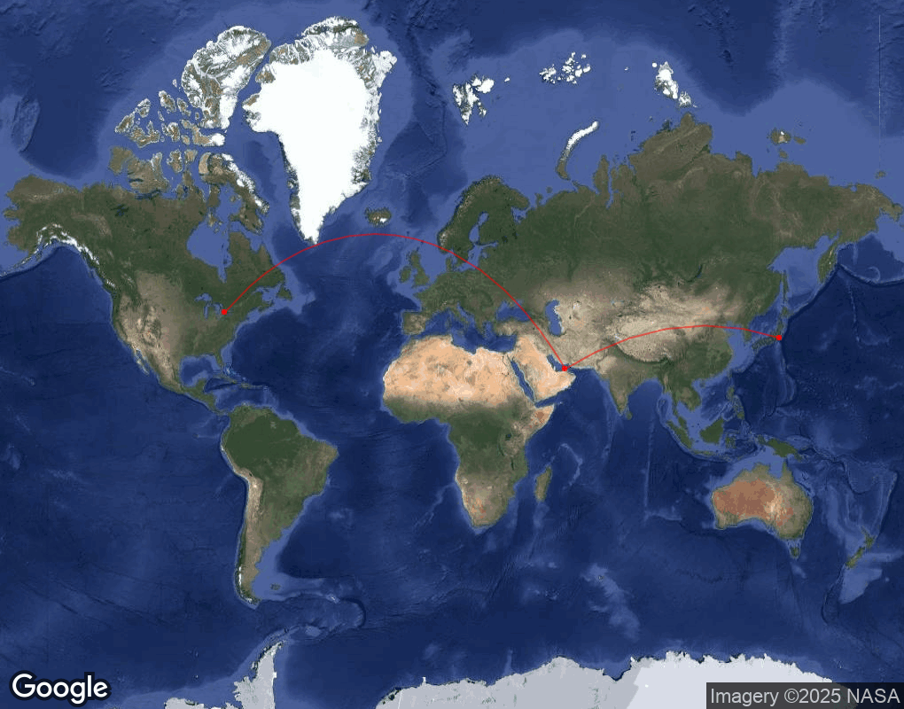

# ✈️ Great Circle Mapper

This is a lightweight GUI tool for visualizing great circle flight paths between any number of global airports using their **ICAO codes**. My first full Python project from early 2024. Motivated by my passion for aviation. 

### 🔍 What it does
- Lets you input a series of ICAO airport codes (e.g., `CYYZ-OMDB-RJAA`).
- Fetches each airport's coordinates using the public [`airportsdata`](https://pypi.org/project/airportsdata/) library.
- Displays a **satellite map** with airport markers and great circle routes between consecutive airports using the **Google Maps Static API**.
- Built with **Tkinter** for the UI and **Pillow** for image rendering.

---

### 🧪 Example
Enter:
```
CYYZ-RKSI-EGLL
```
And the app will show:


---

### 🚀 How to run

1. **Clone this repo**  
   Or download the `.py` file.

2. **Install dependencies**:

   ```bash
   pip install -r requirements.txt
   ```

3. **Set up a Google Maps API key**:
   - Follow this guide: https://developers.google.com/maps/documentation/maps-static/get-api-key
   - Create a .env file in the project root (if not already present).
   - Add the following line to .env:

      ```env
      MAPS_STATIC_API_KEY=YOUR_API_KEY_HERE
      ```
   - The application will automatically load this key from the .env file using os.getenv

4. **Run the app**:
   ```bash
   python great_circle_mapper.py
   ```

---

### 📦 Dependencies
- `airportsdata` — Global airport metadata
- `requests` — For fetching the map image
- `pillow` — For displaying images in Tkinter
- `tkinter` — Built-in GUI framework

---

### 🧠 Notes
- Only ICAO codes (e.g., `KLAX`, not `LAX`) are supported.
- The final leg is drawn between the **last two airports** entered.
- You can chain however many airports as you like, separated by `-`.